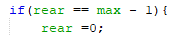
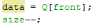
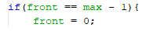
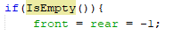
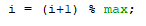
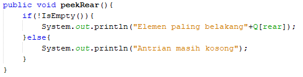
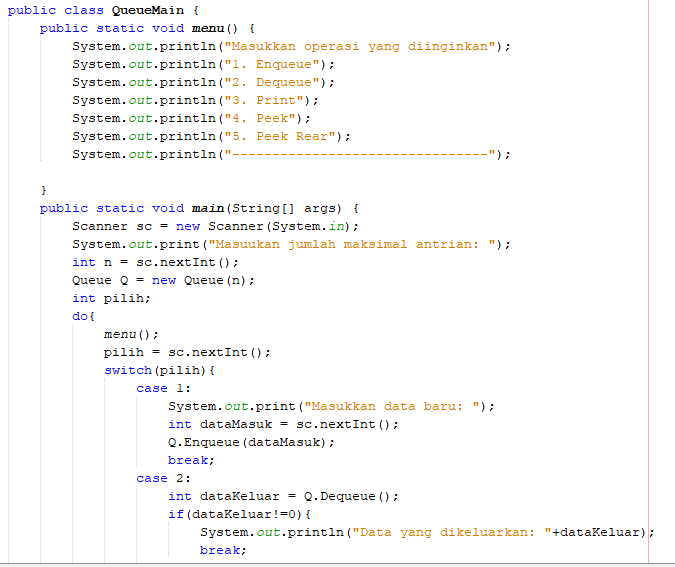
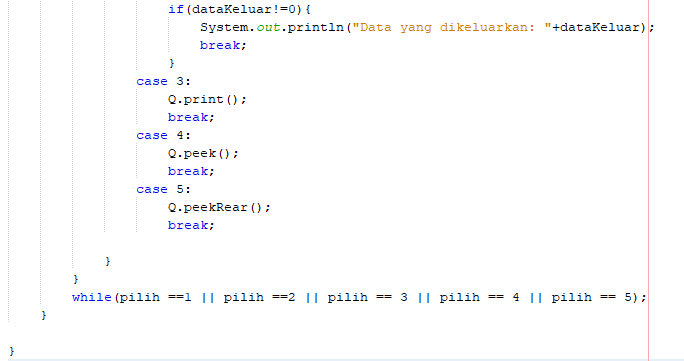

# Laporan Praktikum Queue

## Jawaban Pertanyaan
1. Fungsi dari antribut Q digunakan untuk menyimpan nilai didalam atribut
2. a. Max : atribut/variabel yang digunakan untuk menyimpan banyak data maksimal yang bisa disimpan di dalam queue
   b. Size : atribut/variabel yang digunakan untuk menyimpan berapa banyak data yang ada dalam antrian
   c. Front : atribut/variabel yang digunakan untuk menyimpan nilai indeks array,dimana data terdepan dari antrian berada.
   d. Rear : atribut/variabel yang digunakan untuk menyimpan nilai indeks array, dimana data paling belakang dari antrian berada.
3. Pada method Create mengapa front dan rear diinisialisasi dengan -1, tidak 0 Karena dalam pembuatan atribut baru      antrian belum memiliki nilai sama sekali. index array dimulai dari 0 jika diinisialisasi dengan 0 maka tidak akan bisa karena nilai pada front dan rear akan kosong.
4. Jika pada method IsFull kondisi if diubah menjadi size==max-1 yang terjadi adalah jika kita memiliki antrian dengan jumlah 3. Maka pada kondisi tersebut hanya bisa menyimpan 2. Size=jumlah data-1(3-1=2) maka jumlah antrian dianggap sudah penuh.
5. 
   
   Maksud dari potongan program tersebut adalah jika rear sudah penuh atau sudah mencapai index paling belakang maka penambahan akan dilakukan diindex ke 0 sebagai rear yang baru.
6. 
   
   Q[rear]=data;
   Jika memiliki data baru maka data tersebut akan disimpan di dalam Q
7. Jika method dequeue ber-tipe data void maka tidak akan bisa melakukan pengembalian data (return data)
8. 
   
   data=Q[front];
   digunakan untuk menampilkan posisi paling depan di dalam queue.
9. 
   
   Maksud dari potongan program tersebut adalah jika nilai front sebelum dikeluarkan diindex terakhir (jika max=5, maka index terakhirnya adalah 4, karena max-1) Maka front yang baru akan berada di index ke-0
10. 
   
11. Mengapa pada method print int i=front karena dalam queue nilai yang pertama kali yang dikeluarkan atau ditampilkan    adalah nilai front dan front tidak harus ada di index ke-0.
12. 
   
   Pada potongan program tersebut yang dimaksut adalah untuk menentukan nilai variable yang digunakan dalam perulangan. Dalam queue front atau nilai awalnya tidak selalu pada index ke 0 sehingga digunakan kode program tersebut i=(i+1)%max yang digunakan jika index mencapai index terakhir maka nilai akan kembali ke index ke 0.
13. 
   
   
   