# Laporan Praktikum Linked Lists

## Jawaban Pertanyaan Percobaan
1. Nilai head perlu disimpan dalam variable tmp  karena nilai tmp di awal perulangan untuk menampilkan data yang dimulai  dari head. Dan kemudian perulangan tmp akan berubah ke nilai selanjutnya. Jadi tmp = head digunakan sebagai nilai awal perulangan.
2. Kekurangan jika implementasi sigle LinkedLists tanpa penunjuk tail maka operasi LinkLists tidak bisa dilakukan dari belakang dan hanya bisa dilakukan dari depan
3. Penambahan method addByValue

   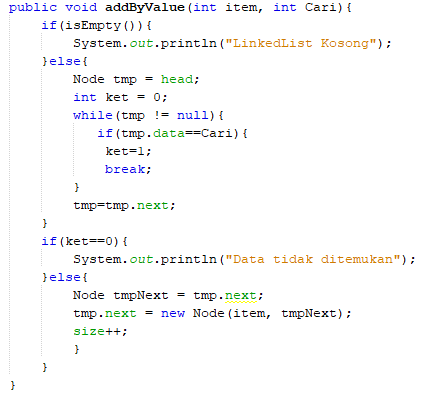
   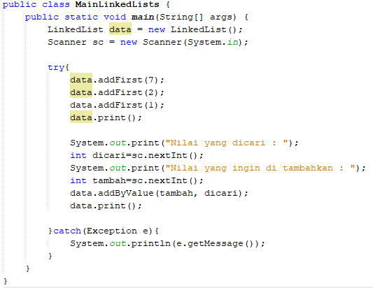
   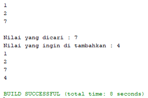

4. Penambahan method removeByValue

   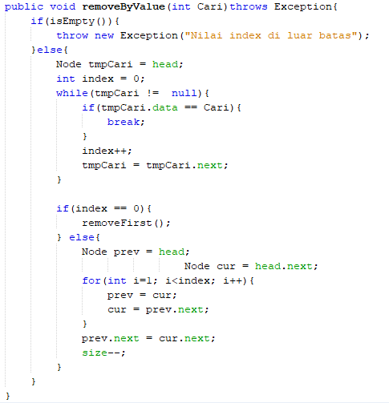
   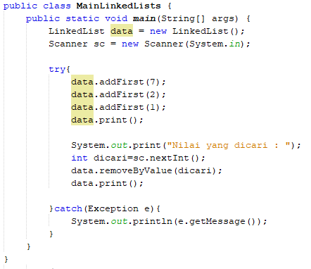
   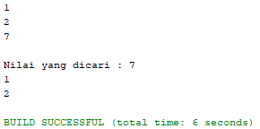

5. Penambahan menu dan submenu 

   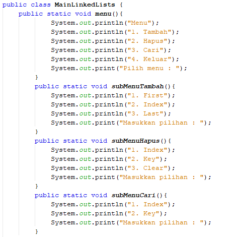
   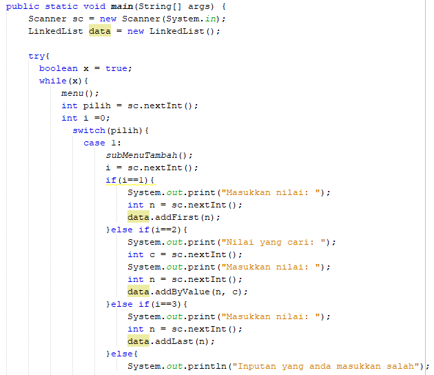
   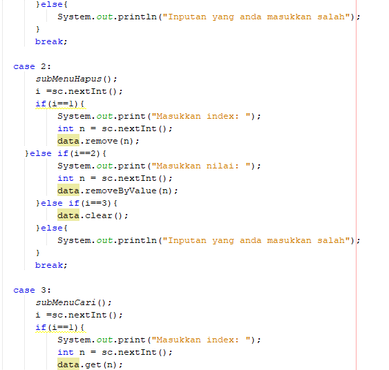
   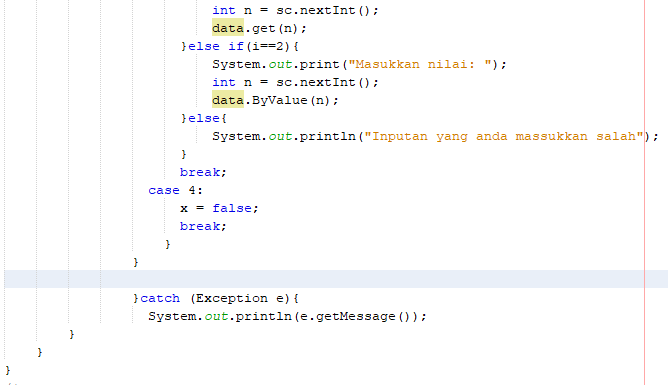
   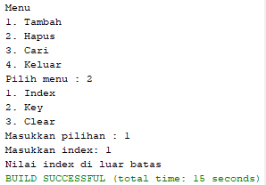