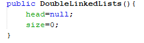
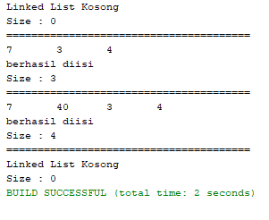
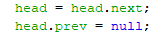
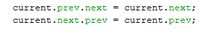
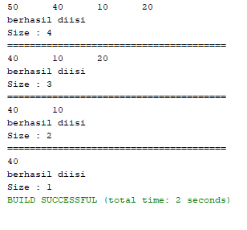
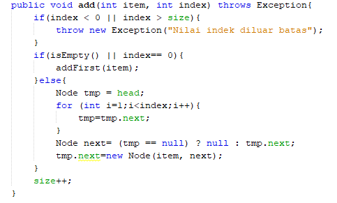
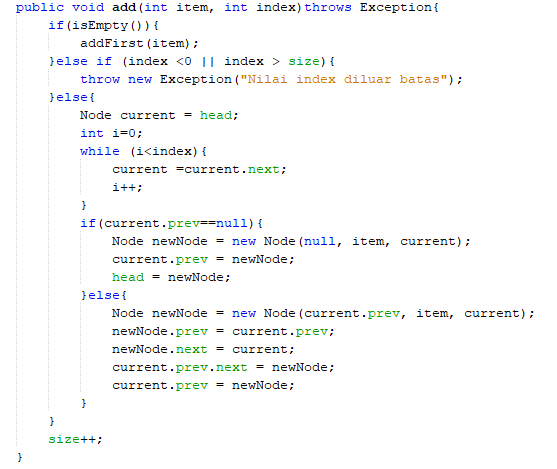
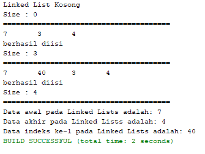

# Laporan Praktikum Double Linked Lists

## Jawaban Pertanyaan 13.3.3
1. Double linked lists adalah linked listb yang memiliki dua buah pointer next dan prev.
Pointer next menunjuk  pada node setelahnya dan pointer prev menunjuk pada node sebelumnya. Double memiliki arti field pointer-nya dua buah dan dua arah, ke node sebelum dan sesudahnya
2. Dalam class Node pointer next digunakan untuk menunjuk pada node sebelumnya. Dan pointer next digunakan untuk menunjuk pada node setelahnya

3.
  
  Pada inisialisasi atribut head dan size diatas digunakan untuk agar head dan size masih kosong. Oleh kareana itu atribut head dengan node pertama masih bernilai 0 dan size yang merupakan jumlah node juga masih 0.

4. Karena pada method addFirst digunakan untuk menambah data diawal pada linked list, sehingga nilai prev bernilai null karena pada sebelumnya tidak terdapat data lain
5. Arti dari statement tersebut adalah newNode yaitu dari node head yang sebelumnya. Sehingga nilai yang masuk disimpan pada node yang baru yaitu newNode  
6. Pada method addLast yang mengisikan parameter prev dengan current, dan next dengan null. Pada method addLast terdapat perulangan untuk mencari data terakhir yang disimpan dalam atribut current. Ketikan kita menambahkan node baru diakhir maka otomatis node tersebut akan menambahkan pada newNode setelah current.

## Hasil Percobaan 1

## Jawaban Pertanyaan 13.4.3
1.
  
  yang dimaksut head=head.next yaitu mengubah head menjadi head node setelahnya. Dan head.prev = null; digunakan untuk mengubah nilai prev head yang baru menjadi null.

2. Yaitu dengan cara menggunakan perulangan while(current.nex.next != null)

3. 
  
Fungsi dari kode program current.prev.next = current.next; adalah untuk mengubah next dari node sebelum current yang menjadi node setelah current.
Fungsi dari kode program current.next.prev = current.prev; adalah untuk menubah prev dari node setelah current menjadi prev current.

## Hasil Percobaan 2

## Jawaban Pertanyaan 13.5.3
1. Kegunaan method size pada DoubleLinkedLists adalah size adalah untuk menentukan jumlah node method disini digunakan  mengembalikan nilai size ke method main
2. Pada program linklist tersebut dimulai dari 0, karena seperti  pada percobaan ketiga yang memiliki output 7 40 3 4 yang memiliki data awal adalah 7 dan indek ke-1 adalah 40. Sehingga linkedlist dimulai pada indeks ke-0 dengan data =7.
3. Pada single list, kita hanya perlu mengubah next dari node sebelum node yang baru, kemudian kita langsung dapat membuat node yang baru. Sedangkan pada doubled linked list, kita perlu mengubah prev dan next dari node setelah dan sebelum node yang baru setelah kita membuat newNode.

Single LinkedLists

Double LinkedLists

## Hasil Percobaan 3

s