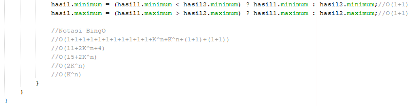

 # Laporan Pratikum Brute Force Divide Conquer 2

 ## Pertanyaan 1
 1. Hasil Output Input Array
    

 2. minMax[] ppArray = new minMax[5] -> sebagai inisialisai
    ppArray[0] = new minMax(); -> sebagai inisialisasi atau memberikan nilai kepada object
 3. Code Program yang menghitung nilai minimal dan maksimal
    
 4. Pada Source code tersebut bahwa nilai 4 adalah index akhir atau batas dari Array yang diinpukan oleh user
 5. Karena Pada pencarian minMax kita memerlukan index awal untuk batas awal Array dan indek akhir untuk batas akhir 
    Array sedangkan indeks tengah untuk mencari nilai tengah Array.Contoh Array 10 ,maka indeks tengah 5.    
 6. Tidak,Karena class sendiri lalu deklarasi class tidak boleh dilakukan didalam kelas lain.
 7. Tidak Bisa karena variabel Arr berfungsi untuk menyimpan data inputan nilai ,jika tidak diberikan maka tidak ada   
    nilai dapat diproses
 8. Code Program Perubahan
    
    bisa langsung memasukkan nilai Array ke paremeter pertama dengan mengubah object 
    nilaiArray ke Array bisa di main
 9. 
 10. Untuk Algoritma lebih mudah jika menggunakan Brute Force sedangkan jika memilih efisensi lebih baik menggunkan     
     Brutre force   
 11. Dinamakan Ternary Operation adalah sebagai else
     Tanda ":" berarting perbandingan kondisi benar atau salah,jika salah maka a>b ?maka 
     c(benar) :d(jika salah)
 12. Tanda ? adalah bagian dari Operating Ternary yang sama seperti simbol menanyakan kondisi(T/F)

 ## Pertanyaan 2
 1. Notasi :
    O(n)*O(n)*O(1) = n*n*1
    Penjelasan:
    1+1+(n*n*1)+(n*n*1) = 2+2*(n^2)
    Tidak ada perubahan operasi dengan pratikum karna sama-sama memiliki 1 intruksi
 2. Jumlah Intruksi:
    n*n*1 = 100*100*1 = 10000
    Penjelasan: 
    n = 100
    1+1+(100*100*1)+(100*100*1) = 2+2*(100^2) = 20002
    Big O(n^2) = 10000
 3. Kode A
    Notasi: O(n)*O(n)*O(1)
    Kode B
    Notasi: O(n)*O()*O(1)
    diantaran kedua kode tersebut berbeda karena di kedua perulangan j tidak literasi sehingga nilai j sealu 0 dan aka menjadi infinity loop

## Tugas
1. Notasi Big O pada Algoritma Brute Force dan Divide Conquer
   a.MainminMax 
   
   
   b.minMax
   
   
2. Fibonacci
   
   
3. Faktorial
   
    
