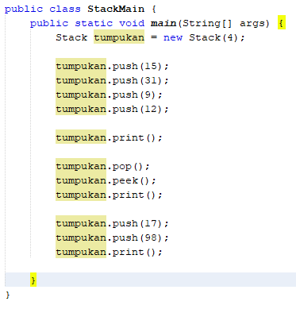
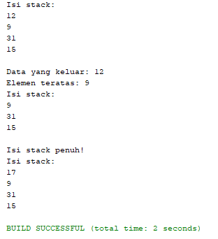
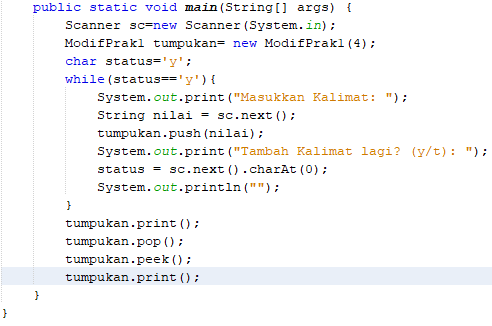
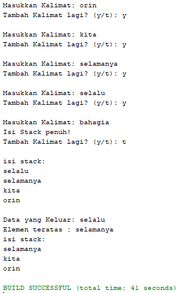
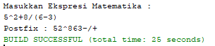
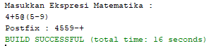
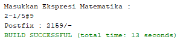

# Laporan Pratikum Stack

## 8.3.3 Jawaban Pertanyaan
1. Untuk memberikan nilai 4 pada ukuran stack

2. Penambahan data angka 17 dan 98.
    
    
3. Karena ukuran stack 4.  Maka jika sudah terisi 4 ke dalam stack. Dan setelah dilakukan peek maka akan mengeluarkan angka 9, sehingga isi stack akan berkurang satu. Sehingga yang bisa mengisi stack hanya satu yaitu angka 17.    

4. Modifikasi :
   
   
5. pada mulanya isi top dengan -1 karena array dalam dimulai dari 0,yang berarti bahwa data stack adalah kosong

## 8.4.3 Jawaban Pertanyaan
1. Fungsi dari method precedence adalah untuk menentukan derajat operator. Derajat operator ini menentukan proses push dan pop operator dalam stack.

2. Run Program:
   
   Pada program tersebut didalam method tanda kurung tidak ditampilkan.
3. Mengapa tanda kurung tidak ditampilkan karena pada program tersebut tanda kurung digunakan untuk menentukan proses yang akan dilakukan. Sehingga tanda kurung tidak akan ditampilkan.

4. Operator @ :
   
   Operator # :
   
    Operator @ atau # tidak akan muncul pada eksekusi karena operator tersebut tidak ada di method IsOperand.
