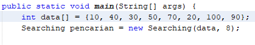
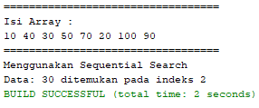
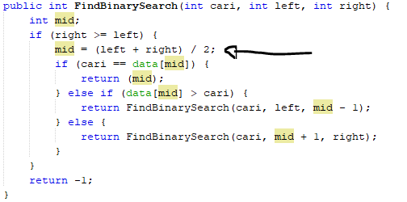
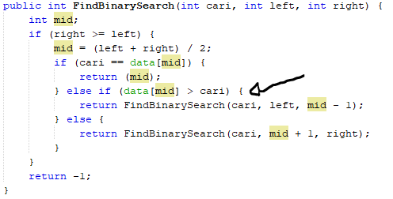
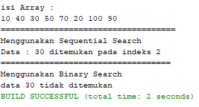
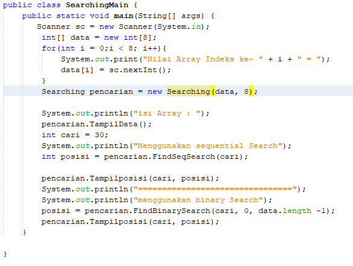
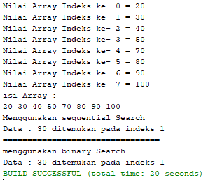

# Laporan Praktikum Searching

## Pertanyaan 1.4.1
1. Fungsi kode program tersebut adalah untuk menampilkan data dan jumlah dari data tersebut.Data ini akan ditampilkan degan isi array yang kita masukkan di main,setelah itu ditampilkan keseluruhan dari isi array tersebut.
2. Fungsi break tersebut adalah untuk menghentikan pencarian nilai data yang dicari jika sudah ditemukan.
3. Pengubahan Array

Output:

Program tersebut masih berjalan dengan benar karena pencarian nilai 30 tersebut berada pada indeks 2.Artinya pencarian data harus secara berurutan dari depan ke belakang berdasarkan key yang dicari yaitu 30 dan ini bisa terjadi apabila isi array masih berjumlah 8.

## Pertanyaan 1.4.2
1.  Kode Program(Proses Divide)

2. Kode Program(Proses Conquer)

3. Output Awal:
10 40 30 50 70 20 100 90
=================================
Menggunakan Sequential Search
data : 30 ditemukan di indeks 2
=================================
Menggunakan Binary Search
data : 30 tidak ditemukan

Mofikasi:
public int FindBinarySearch(int cari, int left, int right) {
        if(data[left] <= data[right]){
            int mid = (left + right)/2;
            
            if(cari == data[mid]){
                return mid;
            }else if(cari < data[mid]){
                return FindBinarySearch(cari,left,mid-1);
            }else{
                return FindBinarySearch(cari,mid+1,right);
            }
        }else if(data[left] >= data[right]){
            int mid = (left + right)/2;
            if(cari == data[mid]){
                return mid;
            }else if(cari < data[mid]){
                return FindBinarySearch(cari,mid+1,right);
            }else{
                return FindBinarySearch(cari,left,mid-1);
            }
        }else{
             return -1;
        } 
    }
Output Setelah Modifikasi
isi Array:
100 90 80 70 60 50 40 30
=================================
Menggunakan Sequential Search
data : 30 ditemukan di indeks 7
==================================
Menggunakan Binary Search
data : 30 ditemukan di indeks 7
 Program masih dapat berjalan dengan hasil dari kode Binary Search tidak sesuai dengan kode program.Karena data belum diuurutkan dengaan metode Merge Sort,sehingga pencarian data tidak dapat dilakukan.
 
 4. Output:
 
 Program masih dapat berjalan dengan hasil dari kode Binary Search tidak sesuai dengan kode program.Karena data belum diuurutkan dengaan metode Merge Sort,sehingga pencarian data tidak dapat dilakukan
 
 5. Modifikasi kode Program:
 
 Output:
 

